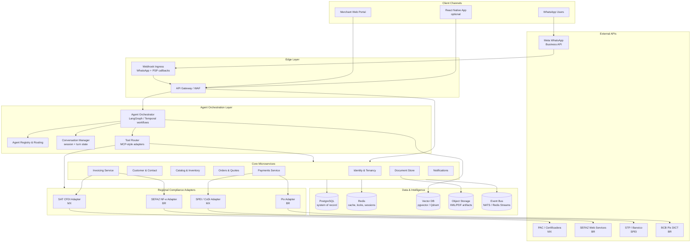
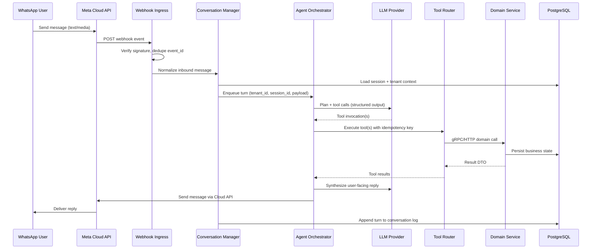
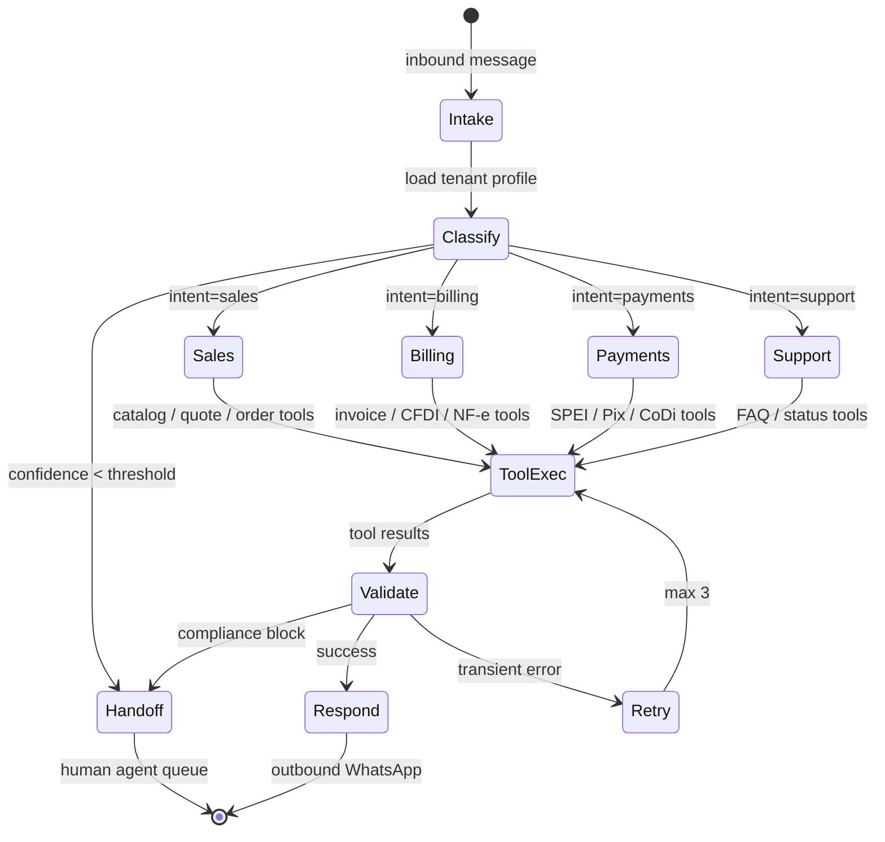
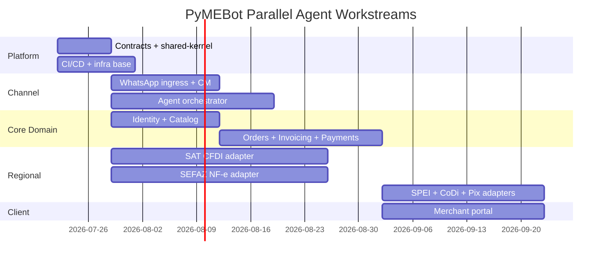
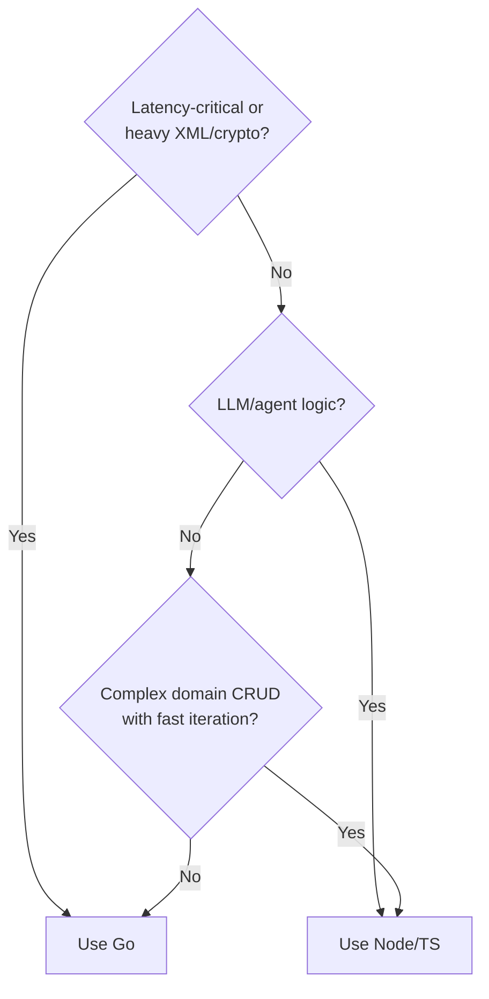
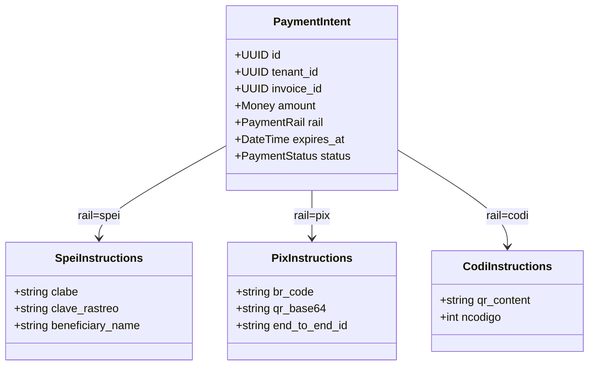
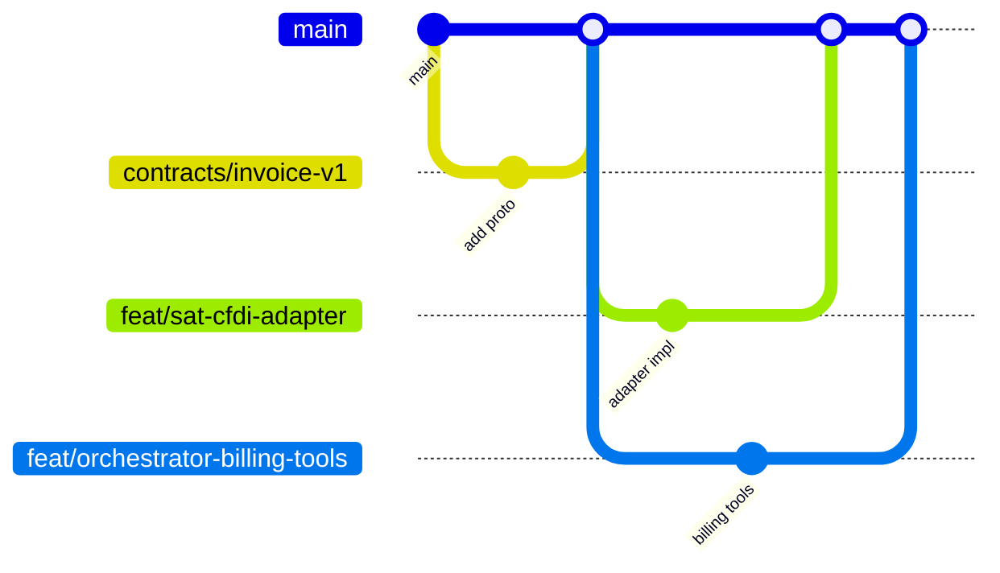

# PyMEBot — Technical Architecture for Parallel Agent Development

**Audience:** Engineering Lead  
**Version:** 1.0  
**Date:** 2026-07-22  
**Status:** Draft for implementation kickoff

---

## Executive Summary

PyMEBot is a WhatsApp-first business assistant for Latin American SMEs (PyMEs). It orchestrates conversational AI agents that handle invoicing, payments, and fiscal compliance across **Mexico** (SAT/CFDI, SPEI, CoDi) and **Brazil** (SEFAZ NF-e, Pix).

This document defines:

1. A **microservices + agent orchestrator** topology anchored on WhatsApp Business API
2. A **monorepo layout** optimized for multiple Cursor/cloud agents working in parallel
3. **Contract-first interfaces** so teams can integrate without blocking each other
4. **Tech stack** choices with clear ownership boundaries
5. **Integration specifications** for regional fiscal and payment rails
6. **CI/CD and multi-agent workflow** for safe parallel development

---

## 1. System Architecture

### 1.1 High-Level Topology



### 1.2 Request Flow — WhatsApp Conversation Turn



### 1.3 Service Boundaries & Responsibilities

| Service | Responsibility | Owns Data |
|---------|----------------|-----------|
| **Webhook Ingress** | Meta signature validation, idempotency, rate-limit buffering | `webhook_events` (short TTL) |
| **Agent Orchestrator** | Multi-step agent workflows, tool planning, human-in-the-loop escalation | `agent_runs`, `tool_invocations` |
| **Conversation Manager** | Session lifecycle, context window assembly, channel routing | `conversations`, `messages` |
| **Identity & Tenancy** | Merchant onboarding, RBAC, API keys, country/legal entity | `tenants`, `users`, `roles` |
| **Customer & Contact** | End-customer CRM linked to WhatsApp `wa_id` | `contacts`, `addresses` |
| **Catalog & Inventory** | Products, services, tax categories, stock | `products`, `price_lists` |
| **Orders & Quotes** | Cart, quote approval, order state machine | `orders`, `order_lines` |
| **Invoicing Service** | Invoice lifecycle, fiscal numbering, artifact generation | `invoices`, `invoice_lines` |
| **Payments Service** | Payment intents, reconciliation, refund flows | `payments`, `payment_events` |
| **Document Store** | Immutable XML/PDF storage, retention policies | metadata in PG, blobs in S3 |
| **Regional Adapters** | Country-specific protocol translation only — no business rules | adapter audit logs |

**Design principle:** Business rules live in **Core** services. Regional adapters are **thin protocol translators** with retry, certificate handling, and mapping to canonical DTOs.

### 1.4 Agent Orchestrator Design



**Orchestrator stack recommendation:**

- **Workflow engine:** Temporal.io (durable timers for payment expiry, invoice retries, SEFAZ polling)
- **Agent framework:** LangGraph or custom state machine with structured tool schemas (JSON Schema / OpenAPI)
- **Tool interface:** Internal MCP-compatible registry — each domain service exposes typed tools

### 1.5 Multi-Tenancy & Security

- **Tenant isolation:** Row-level security (RLS) in PostgreSQL + `tenant_id` on every table
- **Secrets:** HashiCorp Vault or AWS Secrets Manager — CSD/FIEL (MX), A1 certificates (BR), PSP credentials
- **Webhook security:** HMAC verification (Meta), mTLS where supported (some PSP/bank integrations)
- **PII:** Field-level encryption for RFC, CPF/CNPJ, CLABE, Pix keys; audit log immutability
- **Compliance:** Data residency per country (MX data in `mx-central-1`, BR in `sa-east-1`) with global control plane

---

## 2. Repository Structure for Parallel AI Agents

### 2.1 Monorepo Layout

```
pyme-bot/
├── docs/
│   ├── ARCHITECTURE.md          # This document
│   ├── adr/                     # Architecture Decision Records
│   └── runbooks/
├── contracts/                   # Source of truth for parallel work
│   ├── openapi/                 # REST external + internal APIs
│   │   ├── gateway.v1.yaml
│   │   ├── invoicing.v1.yaml
│   │   └── payments.v1.yaml
│   ├── proto/                   # gRPC internal service contracts
│   │   ├── invoicing/v1/
│   │   ├── payments/v1/
│   │   └── orchestrator/v1/
│   ├── events/                  # Async event schemas (AsyncAPI)
│   │   ├── invoice.issued.v1.json
│   │   └── payment.confirmed.v1.json
│   ├── agents/                  # Tool schemas for orchestrator
│   │   ├── tools.billing.json
│   │   └── tools.payments.json
│   └── fixtures/                # Golden test payloads per country
│       ├── mx/
│       └── br/
├── apps/
│   ├── gateway/                 # Agent A: API Gateway (Go)
│   ├── webhook-ingress/         # Agent B: WhatsApp webhooks (Node/Go)
│   ├── orchestrator/            # Agent C: Agent workflows (Node/Python)
│   ├── conversation-manager/    # Agent D: Session state (Go)
│   ├── merchant-portal/         # Agent E: React web (optional RN shared)
│   └── mobile/                  # Agent F: React Native (optional, Phase 2)
├── services/
│   ├── identity/                # Agent G
│   ├── catalog/                 # Agent H
│   ├── orders/                  # Agent I
│   ├── invoicing/               # Agent J
│   ├── payments/                # Agent K
│   └── notifications/           # Agent L
├── adapters/
│   ├── sat-cfdi/                # Agent M: Mexico fiscal
│   ├── sefaz-nfe/               # Agent N: Brazil fiscal
│   ├── spei/                    # Agent O
│   ├── codi/                    # Agent P
│   └── pix/                     # Agent Q
├── packages/
│   ├── shared-kernel/           # IDs, money, errors, tenant context
│   ├── db-migrations/           # Single migration pipeline
│   ├── event-bus/               # Publisher/subscriber SDK
│   ├── observability/           # OTel, logging conventions
│   └── testcontainers/          # Integration test harness
├── infra/
│   ├── terraform/               # Agent R: IaC modules per env
│   ├── k8s/                     # Helm charts
│   └── docker/
├── .cursor/
│   └── rules/                   # Per-module agent instructions
│       ├── gateway.mdc
│       ├── sat-cfdi.mdc
│       └── ...
├── .github/workflows/
├── turbo.json                   # or nx.json — build graph
└── Taskfile.yml                 # Local dev orchestration
```

### 2.2 Contract-First Development Rule

**No service merges without:**

1. OpenAPI/Proto/AsyncAPI change in `contracts/` (PR labeled `contract-change`)
2. Generated stubs updated (`make generate`)
3. Contract tests passing (`make contract-test`)
4. Consumer-driven fixture tests in `contracts/fixtures/`

This is the **primary coordination mechanism** for parallel Cursor/cloud agents.

### 2.3 Module Ownership Matrix

| Path | Owner Agent | Depends On (read-only) |
|------|-------------|------------------------|
| `contracts/*` | Platform lead (human gate) | — |
| `packages/shared-kernel` | Platform agent | `contracts/` |
| `apps/webhook-ingress` | Agent B | `contracts/openapi`, Meta SDK |
| `apps/orchestrator` | Agent C | `contracts/agents`, `contracts/proto` |
| `services/invoicing` | Agent J | `contracts/proto`, `packages/shared-kernel` |
| `adapters/sat-cfdi` | Agent M | `contracts/proto`, `fixtures/mx` |
| `adapters/sefaz-nfe` | Agent N | `contracts/proto`, `fixtures/br` |
| `infra/terraform` | Agent R | service deployment manifests |

---

## 3. Parallel Development — Components & Interfaces

### 3.1 Dependency Layers (Build Order)

```mermaid
flowchart LR
    subgraph L0["Layer 0 — Week 1 (blocking)"]
        C[contracts/]
        SK[shared-kernel]
        DB[db-migrations]
        OBS[observability]
    end

    subgraph L1["Layer 1 — Parallel Week 1–2"]
        ID[identity]
        WH[webhook-ingress]
        CM[conversation-manager]
        CAT[catalog]
    end

    subgraph L2["Layer 2 — Parallel Week 2–4"]
        ORD[orders]
        INV[invoicing]
        PAY[payments]
        AO[orchestrator]
    end

    subgraph L3["Layer 3 — Parallel Week 3–6"]
        SAT[sat-cfdi]
        NFE[sefaz-nfe]
        SPEI[spei]
        PIX[pix]
        CODI[codi]
    end

    subgraph L4["Layer 4 — Week 5+"]
        PORTAL[merchant-portal]
        RN[mobile]
    end

    L0 --> L1 --> L2 --> L3
    L2 --> L4
    L3 --> L4
```



### 3.2 Interface Catalog

#### 3.2.1 Synchronous — gRPC Internal (`contracts/proto/`)

| RPC | Producer | Consumers | Canonical DTO |
|-----|----------|-----------|-----------------|
| `InvoicingService.CreateDraft` | invoicing | orchestrator, orders | `InvoiceDraft` |
| `InvoicingService.Issue` | invoicing | orchestrator | `IssueInvoiceRequest` → `FiscalDocument` |
| `InvoicingService.GetStatus` | invoicing | orchestrator, portal | `FiscalDocumentStatus` |
| `PaymentsService.CreateIntent` | payments | orchestrator, orders | `PaymentIntent` |
| `PaymentsService.GetIntent` | payments | orchestrator, webhook-ingress | `PaymentIntentStatus` |
| `CatalogService.SearchProducts` | catalog | orchestrator | `ProductPage` |
| `OrdersService.CreateFromQuote` | orders | orchestrator | `Order` |
| `IdentityService.ResolveTenantByWaPhone` | identity | webhook-ingress, CM | `TenantContext` |

#### 3.2.2 Asynchronous — Events (`contracts/events/`)

| Event | Publisher | Subscribers |
|-------|-----------|-------------|
| `invoice.draft.created.v1` | invoicing | notifications, orchestrator |
| `invoice.issued.v1` | invoicing | payments, document-store, notifications |
| `invoice.cancelled.v1` | invoicing | payments, sat-cfdi/sefaz-nfe |
| `payment.intent.created.v1` | payments | notifications |
| `payment.confirmed.v1` | payments | invoicing, orders, orchestrator |
| `payment.expired.v1` | payments | orchestrator, notifications |
| `fiscal.submission.accepted.v1` | adapters | invoicing, document-store |
| `fiscal.submission.rejected.v1` | adapters | invoicing, orchestrator |

#### 3.2.3 Agent Tools (`contracts/agents/`)

Each tool maps 1:1 to an orchestrator action with JSON Schema:

```json
{
  "name": "create_payment_intent",
  "description": "Generate SPEI or Pix payment instructions for an invoice",
  "input_schema": { "$ref": "../openapi/payments.v1.yaml#/components/schemas/CreatePaymentIntentRequest" },
  "service": "payments",
  "idempotent": true
}
```

### 3.3 Mock Strategy for Parallel Agents

| Interface | Mock Implementation | Location |
|-----------|---------------------|----------|
| SAT CFDI | Record/replay from `fixtures/mx/cfdi/` | `adapters/sat-cfdi/internal/mock` |
| SEFAZ NF-e | Homologation environment + fixture XML | `adapters/sefaz-nfe/internal/mock` |
| SPEI/CoDi | STP sandbox simulator | `adapters/spei/internal/simulator` |
| Pix | DICT/BACEN sandbox | `adapters/pix/internal/sandbox` |
| WhatsApp | Meta test numbers + webhook replay | `apps/webhook-ingress/internal/fixtures` |

**Rule:** Orchestrator and core services MUST run integration tests against mocks, not live government/PSP APIs.

### 3.4 Parallel Workstreams (Suggested Agent Assignment)



---

## 4. Tech Stack Recommendations

### 4.1 Stack Summary

| Layer | Recommendation | Rationale |
|-------|----------------|-----------|
| **Mobile (optional)** | React Native + Expo | Shared TS types with portal; OTA updates for SME users |
| **Web portal** | React 19 + Vite + TanStack Query | Fast iteration; aligns with RN if shared `packages/ui` |
| **API Gateway** | Go (Fiber/Chi) + OpenAPI codegen | Low latency, strong concurrency for webhooks |
| **Core microservices** | Go for hot path; Node (NestJS) for rapid CRUD | Go: webhook-ingress, payments, conversation-manager. Node: catalog, orders |
| **Agent orchestrator** | Node (TypeScript) + Temporal | Rich LLM SDK ecosystem; Temporal for durable workflows |
| **Regional adapters** | Go | x509, XML, SOAP performance for SAT/SEFAZ |
| **Primary DB** | PostgreSQL 16 + RLS | ACID, JSONB for fiscal payloads, `pgvector` for RAG |
| **Cache / sessions** | Redis 7 (Cluster) | Session cache, rate limits, idempotency keys, pub/sub |
| **Vector DB** | pgvector (Phase 1) → Qdrant (Phase 2) | Start simple; split if embedding volume > 10M |
| **Object storage** | S3-compatible (MinIO dev, AWS S3 prod) | XML/PDF artifacts, media from WhatsApp |
| **Event bus** | NATS JetStream | Lightweight, at-least-once, good for SME scale |
| **Search** | PostgreSQL FTS → OpenSearch (Phase 2) | Product/customer search |
| **Observability** | OpenTelemetry → Grafana stack | Unified traces across agents + services |
| **Secrets** | Vault | Certificate lifecycle for CSD/A1 |

### 4.2 Language Split Decision Tree



### 4.3 Data Model — Canonical Fiscal/Payment Entities

```
Tenant
 └── LegalEntity (country: MX | BR)
      ├── FiscalProfile (RFC/CNPJ, régimen, certificate refs)
      ├── InvoiceSeries (folio ranges, NF-e series)
      └── PaymentRails (SPEI CLABE, Pix key, CoDi enabled)

Contact (wa_id, tax_id optional)
Order → Invoice → FiscalDocument (UUID, country, status)
PaymentIntent (rail: spei | pix | codi, amount, expiry)
PaymentEvent (webhook-derived, reconciled)
```

---

## 5. Integration Specifications

### 5.1 Mexico — SAT CFDI 4.0

| Item | Specification |
|------|---------------|
| **Standard** | CFDI 4.0, complementos as required (Pagos 2.0, Carta Porte if applicable) |
| **Signing** | CSD (Certificado de Sello Digital) — RSA-SHA256 |
| **Timbrado** | Via PAC (authorized provider) — do not self-stamp in production |
| **Transport** | HTTPS REST (PAC-specific) or SOAP (legacy); adapter abstracts both |
| **Key flows** | `CreateDraft` → validate XSD → `Stamp` (PAC) → store XML + UUID → `Cancel` (motivo, replacement UUID) |
| **Idempotency** | `tenant_id + series + folio` OR client-supplied `idempotency_key` |
| **Storage** | Immutable XML in S3; metadata + UUID in PostgreSQL |
| **Errors** | Map PAC/SAT codes → `FiscalErrorCode` enum in shared-kernel |
| **Testing** | SAT certificación environment + recorded fixtures |

**Adapter interface (`FiscalProviderMX`):**

```protobuf
service SatCfdiAdapter {
  rpc ValidateDraft(ValidateDraftRequest) returns (ValidationResult);
  rpc Stamp(StampRequest) returns (StampResult);      // returns UUID, XML ref
  rpc Cancel(CancelRequest) returns (CancelResult);
  rpc GetStatus(GetStatusRequest) returns (FiscalStatus);
}
```

### 5.2 Brazil — SEFAZ NF-e (modelo 55)

| Item | Specification |
|------|---------------|
| **Standard** | NF-e 4.0 (layout 4.00), NFC-e if retail (modelo 65) — separate adapter impl |
| **Signing** | A1 certificate (PFX), XML-DSig |
| **Transport** | SOAP 1.2, state-specific endpoints (UF autorizadora) |
| **Key flows** | `GenerateXML` → sign → `Autorizacao` (sync ≤ 500KB else batch) → poll `RetAutorizacao` → store procNFe |
| **Contingency** | FS-DA / EPEC modes — adapter feature-flag per tenant |
| **Cancellation** | Evento 110111 within 24h window (business rule in invoicing service) |
| **Idempotency** | `cNF` + `serie` + `nNF` with tenant-scoped numbering |
| **Testing** | SEFAZ homologação per UF; national test vectors |

**Adapter interface (`FiscalProviderBR`):**

```protobuf
service SefazNfeAdapter {
  rpc Authorize(AuthorizeRequest) returns (AuthorizeResult);
  rpc PollAuthorization(PollRequest) returns (AuthorizeResult);
  rpc CancelEvent(CancelEventRequest) returns (EventResult);
  rpc GetDanfePdf(GetDanfeRequest) returns (PdfResult);
}
```

### 5.3 Mexico — SPEI (via STP or bank PSP)

| Item | Specification |
|------|---------------|
| **Model** | Merchant CLABE per tenant (cost center) or shared CLABE + tracking reference |
| **Flow** | `CreatePaymentIntent` → generate `claveRastreo` + amount + beneficiary → user pays via bank app → STP webhook (`abono`) → reconcile |
| **Webhook** | Verify origin IP + signature; idempotent on `claveRastreo` |
| **Reconciliation** | Match amount (exact), beneficiary account, reference field |
| **Expiry** | Default 24–72h; Temporal timer publishes `payment.expired.v1` |
| **Adapter** | `SpeiAdapter.CreateTrackingReference`, `SpeiAdapter.ParseWebhook` |

### 5.4 Mexico — CoDi (Cobro Digital)

| Item | Specification |
|------|---------------|
| **Model** | Banco de México CoDi — QR/NFC push via participating bank |
| **Flow** | Register merchant with participating bank → generate payment request (QR string) → push notification to payer bank app → confirmation webhook |
| **WhatsApp delivery** | Send QR as image + copy-paste string; deep link where supported |
| **Adapter** | `CodiAdapter.CreateCharge`, `CodiAdapter.HandleNotification` |
| **Note** | CoDi adoption varies; feature-flag per tenant; SPEI fallback always available |

### 5.5 Brazil — Pix

| Item | Specification |
|------|---------------|
| **Models** | Static QR, dynamic QR (cob), Pix Copia e Cola |
| **Flow** | `CreatePaymentIntent` → PSP creates cobrança → return BR Code → payer scans → PSP webhook `PIX_RECEBIDO` → reconcile via `endToEndId` |
| **Keys** | EVP (random), CNPJ, email, phone — stored in Vault |
| **Webhook** | mTLS or HMAC (PSP-dependent); idempotent on `endToEndId` |
| **Refunds** | Devolução via PSP API — `PixAdapter.Refund` |
| **WhatsApp delivery** | Copia e Cola text + QR image |

**Unified Payments Canonical Model:**



### 5.6 Cross-Border Integration Principles

1. **Single invoicing API** — country resolved from `LegalEntity.country`
2. **Adapter registry** — `FiscalProviderFactory.get(country)` at runtime
3. **No fiscal logic in orchestrator** — tools call invoicing/payments services only
4. **All external payloads archived** — raw webhook body stored before parsing (audit)
5. **Certificate rotation** — 30/14/7-day alerts; automated re-enrollment where supported

---

## 6. CI/CD and Multi-Agent Workflow

### 6.1 Branch & PR Strategy



| Branch prefix | Purpose | CI profile |
|---------------|---------|------------|
| `contracts/*` | Schema changes only | `contract-test` + breaking-change detector |
| `feat/<module>/*` | Single module/feature | Module-scoped test + build |
| `fix/*` | Bug fixes | Same as touched module |
| `infra/*` | Terraform/K8s | `terraform plan` + policy check |

**Rules for cloud agents:**

1. One agent = one module path (from ownership matrix)
2. Max PR scope: 800 LOC or 20 files (soft limit — human review otherwise)
3. Must include module-local tests; integration tests if contract consumer
4. Never modify `contracts/` without `contract-change` label + platform approval

### 6.2 CI Pipeline


**Affected-module detection:** Turborepo/Nx graph — only rebuild changed services and dependents.

### 6.3 Cursor / Cloud Agent Operating Model

| Phase | Action |
|-------|--------|
| **Bootstrap** | Platform agent lands `contracts/`, `shared-kernel`, CI skeleton |
| **Assign** | Each agent gets: module path, `.cursor/rules/<module>.mdc`, fixture data, mock endpoints |
| **Implement** | Agent reads contracts only — no cross-module edits |
| **Verify** | `task test:module <name>` + `task contract-test` locally |
| **Integrate** | Preview env composes all services via Docker Compose / ephemeral K8s namespace |
| **Gate** | Human review on `contracts/`, `db-migrations/`, `infra/` |

**Agent instruction file template** (`.cursor/rules/sat-cfdi.mdc`):

```markdown
# sat-cfdi adapter agent
- Scope: adapters/sat-cfdi/** only
- Contracts: contracts/proto/invoicing/v1, contracts/fixtures/mx/**
- Do NOT edit: services/invoicing (read contracts instead)
- Required tests: XSD validation, stamp mock, cancel mock
- Run before PR: task test:module sat-cfdi
```

### 6.4 Environment Topology

| Environment | Purpose | External APIs |
|-------------|---------|---------------|
| **local** | Agent dev | All mocked |
| **preview** | Per-PR ephemeral | Mocks + Meta test number |
| **staging** | Integration | SAT/SEFAZ homologação, PSP sandboxes |
| **production** | Live | PAC, SEFAZ prod, STP, Pix PSP |

### 6.5 Release Strategy

- **Independent service deploys** — semantic versioning per service image
- **Contract compatibility** — backward-compatible proto/OpenAPI only in minor releases; breaking changes require `/v2` path
- **Feature flags** — LaunchDarkly or Flipt for CoDi, NF-e contingency, new agent tools
- **DB migrations** — expand/contract pattern; single `db-migrations` pipeline owned by platform

### 6.6 Observability for Agent Debugging

- **Correlation ID:** `X-Request-Id` propagated from webhook → orchestrator → all RPCs
- **Agent run tracing:** Each LLM turn = span with tool child spans
- **Fiscal audit dashboard:** stamp latency, rejection codes by PAC/UF, certificate expiry
- **Payment reconciliation dashboard:** unmatched webhooks, amount mismatches

---

## 7. Implementation Phases

| Phase | Scope | Exit Criteria |
|-------|-------|---------------|
| **P0 — Platform** | contracts, CI, identity, webhook, CM | WhatsApp echo bot with tenant resolution |
| **P1 — MX MVP** | catalog, orders, invoicing, SAT adapter, SPEI | Issue CFDI + receive SPEI payment E2E |
| **P2 — BR MVP** | NF-e adapter, Pix | Issue NF-e + Pix payment E2E |
| **P3 — CoDi + Portal** | CoDi adapter, merchant portal | CoDi QR via WhatsApp; self-service config |
| **P4 — Mobile** | React Native | Push notifications, offline catalog browse |

---

## 8. Open Decisions (ADR Candidates)

| # | Decision | Options | Recommendation |
|---|----------|---------|----------------|
| ADR-001 | Orchestrator language | Python vs Node | Node + Temporal |
| ADR-002 | Vector DB split threshold | pgvector only vs Qdrant | pgvector until 10M embeddings |
| ADR-003 | PAC provider (MX) | SW Sapien, Finkok, etc. | Evaluate cost + SLA; abstract in adapter |
| ADR-004 | Pix PSP (BR) | Gerencianet, Stark, bank direct | PSP with strong sandbox + mTLS |
| ADR-005 | Monorepo tool | Turborepo vs Nx | Turborepo (simpler for polyglot) |

---

## 9. Appendix — Quick Reference Endpoints

| Service | Internal Port | Health | Metrics |
|---------|---------------|--------|---------|
| gateway | 8080 | `/healthz` | `/metrics` |
| webhook-ingress | 8081 | `/healthz` | `/metrics` |
| orchestrator | 8082 | `/healthz` | `/metrics` |
| invoicing | 9091 gRPC | gRPC health | OTel |
| payments | 9092 gRPC | gRPC health | OTel |
| sat-cfdi | 9093 gRPC | gRPC health | OTel |
| sefaz-nfe | 9094 gRPC | gRPC health | OTel |

---

*Document maintained in `docs/ARCHITECTURE.md`. Changes to service boundaries require platform lead approval.*
