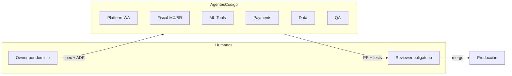

# PyMEBot — Equipo Interdisciplinario y Agentes IA en Paralelo

**Ingeniero a cargo:** Staff/Lead Engineer  
**Versión:** 1.0 · 2026-07-22

---

## Organigrama (14 roles élite)

```
                              CEO
                               │
          ┌────────────────────┼────────────────────┐
          │                    │                    │
         CTO              Head Product           Head Ops
          │                    │                    │
     ┌────┴────┐          UX + Growth         CS + Vendors
     │         │
  WA Lead   Staff QA
     │
 AI Director ── NLP Engineer
     │
 Fiscal Director ── Payments Lead
     │
 Data Lead ── CISO
```

---

## Roles y ownership

| # | Rol | Por qué es crítico | Lidera (sprints) | Owner agente IA |
|---|-----|-------------------|------------------|-----------------|
| 1 | **CTO / Arquitecto** | Arquitectura regulada sin deuda fatal | S0, S2, S6 | Platform + contracts |
| 2 | **Lead WhatsApp** | WhatsApp *es* el producto | S1, S4, S8 | Agent-Platform-WA |
| 3 | **Director IA/ML** | Precisión fiscal conversacional | S3, S7, S11 | Agent-ML-Tools |
| 4 | **NLP / Agentes** | Tool-calling robusto | S3, S5, S9 | Agent-ML-Tools (co) |
| 5 | **Head Product** | JTBD micro-PyME > features | S0, S2, S6 | — (valida outputs) |
| 6 | **Lead UX WhatsApp** | Turnos cortos, confianza, tono | S1, S4, S7 | Agent-Growth-Content |
| 7 | **Director Fiscal** | Error fiscal = multa/cierre | S2, S5, S10 | Agent-Fiscal-MX/BR |
| 8 | **Lead Payments** | Cierra loop valor + revenue | S4, S8, S12 | Agent-Payments |
| 9 | **Head Growth** | Distribución WA sin ban | S3, S6, S9 | Agent-Growth-Content |
| 10 | **Head Data** | Conversación + fiscal + pagos unificados | S2, S5, S8 | Agent-Data |
| 11 | **CISO / Compliance** | RFC, CNPJ, ingresos — filtración = muerte | S1, S4, S7, S12 | Agent-Security |
| 12 | **Head CS micro-PyME** | Abandono onboarding = killer #1 | S2, S5, S8 | Agent-CS-KB |
| 13 | **Head Ops** | Runbooks PAC/PSP, incidentes | S6, S10, S12 | Agent-Ops-Runbooks |
| 14 | **Staff QA** | Release discipline bancario-lite | S1, S5, S11 | Agent-QA |

---

## Matriz RACI (workstreams)

| Workstream | A (Accountable) | R (Responsible) |
|------------|-----------------|-----------------|
| Plataforma WhatsApp | CTO | WA Lead |
| Motor IA / agentes | AI Director | NLP Engineer |
| Producto y roadmap | Head Product | UX + Growth |
| Cumplimiento SAT/SEFAZ | Director Fiscal | QA (regression) |
| Pagos y conciliación | Lead Payments | Data (reconciliación) |
| Seguridad LGPD/LFPDPPP | CISO | Ops (incidentes) |
| QA & release | Staff QA | Todos los leads (C) |

---

## Rituales

| Ritual | Frecuencia | Duración | Participantes |
|--------|------------|----------|---------------|
| Standup async | Diario | 15 min | Todo el equipo |
| **Agent Sync** | Diario | 15 min | CTO + sprint lead + owners agentes |
| Fiscal/Pagos pulse | Diario hábil | 10 min | Fiscal, Payments, Ops, QA |
| Sprint planning | Quincenal | 2 h | Todos los leads |
| Demo + retro | Quincenal | 1.5 h | Equipo completo |
| AI eval review | Semanal | 1 h | AI, NLP, Fiscal, QA |
| Risk & compliance council | Semanal | 45 min | CISO, Fiscal, CTO |

---

## Framework de decisiones

| Nivel | Ejemplos | Decisor | SLA |
|-------|----------|---------|-----|
| L1 | Copy, refactor interno | Sprint lead | <24 h |
| L2 | Flujo onboarding, plantilla HSM | Product + UX | <48 h |
| L3 | Regla fiscal, PSP, retención datos | Fiscal/CISO/Payments + CTO | <72 h |
| L4 | Nuevo país, pivot | CEO + todos los heads | 1 semana |

**Two-key rule:** cambios en dinero o timbrado = 2 aprobaciones humanas.

---

## Agentes IA en paralelo (modelo operativo)



### Asignación sprint 1–2 (arranque paralelo)

| Agente | Módulo | Branch | Owner humano | Depende de |
|--------|--------|--------|--------------|------------|
| **Agent-0-Platform** | `contracts/`, `packages/shared-kernel` | `feat/contracts-9ff6` | CTO | — |
| **Agent-1-WA** | `apps/webhook-ingress`, `apps/conversation-manager` | `feat/whatsapp-9ff6` | WA Lead | Agent-0 |
| **Agent-2-Identity** | `services/identity` | `feat/identity-9ff6` | CTO | Agent-0 |
| **Agent-3-Orchestrator** | `apps/orchestrator`, prompts Fase 0–1 | `feat/orchestrator-9ff6` | AI Director | Agent-0 |
| **Agent-4-Catalog** | `services/catalog` | `feat/catalog-9ff6` | NLP Engineer | Agent-0, Agent-2 |
| **Agent-5-QA** | `tests/e2e`, golden datasets | `feat/qa-harness-9ff6` | Staff QA | Agent-0 |

### Reglas de oro

1. **1 owner humano por agente** — accountability clara.
2. **PRs <400 LOC** en repos críticos (`fiscal/`, `payments/`, `auth/`).
3. **No merge autónomo** en módulos regulados.
4. **Spec-first:** ticket con criterios de aceptación + rollback plan.
5. **Máx. 4 agentes concurrentes** por sprint lead, cola priorizada.
6. **Contract-first:** cambios en `contracts/` requieren aprobación CTO.

---

## Agentes conversacionales (runtime) vs agentes de código

| Tipo | Función | Prompts en |
|------|---------|------------|
| **Runtime** | Responden en WhatsApp (Product, Fiscal, Payment, Support, QA) | `docs/AI-PROMPTS-LIBRARY.md` |
| **Código** | Implementan microservicios en paralelo | `.cursor/rules/<module>.mdc` |
| **Eval** | Quality gates por fase | `docs/AI-PROMPTS-LIBRARY.md` § Gates |

---

## Métricas del equipo (mes 6)

| Área | Meta |
|------|------|
| Producto | 500+ micro-PyMEs activas; activación D7 >40% |
| Fiscal | >99.5% timbres exitosos MX |
| IA | Intent fiscal >95%; escalamiento humano <15% |
| WhatsApp | Respuesta mediana <3s; 0 bans |
| Ingeniería | 30–40% throughput vía agentes IA; bug rate post-merge <5% |
